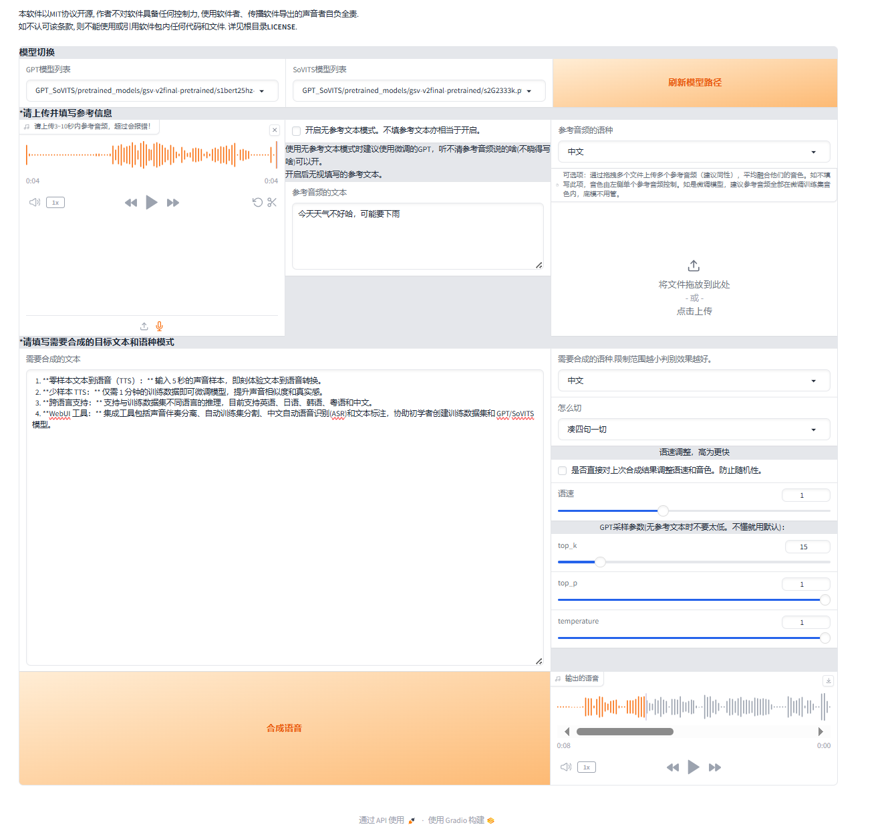
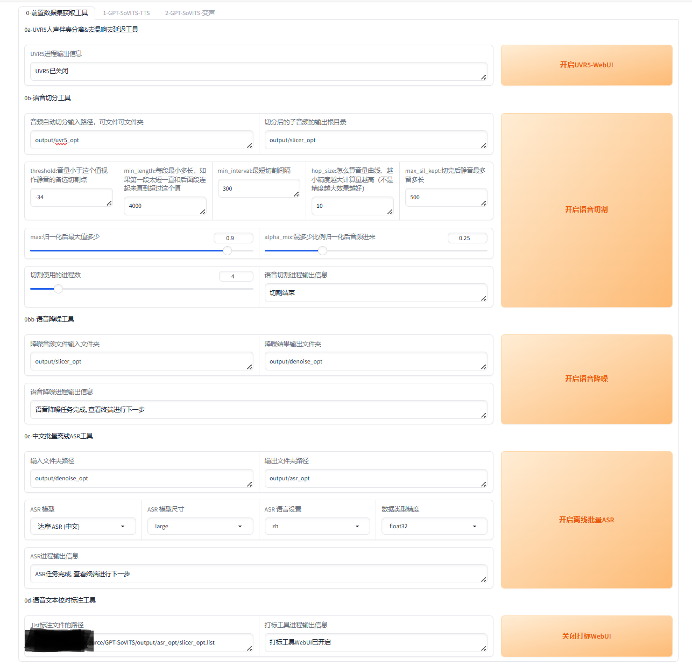
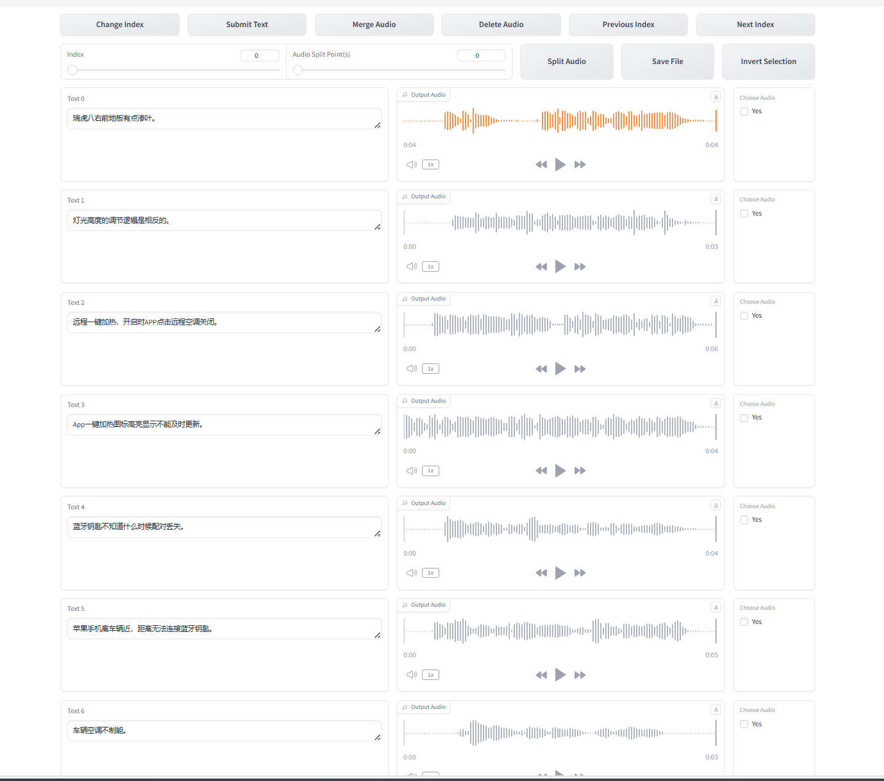
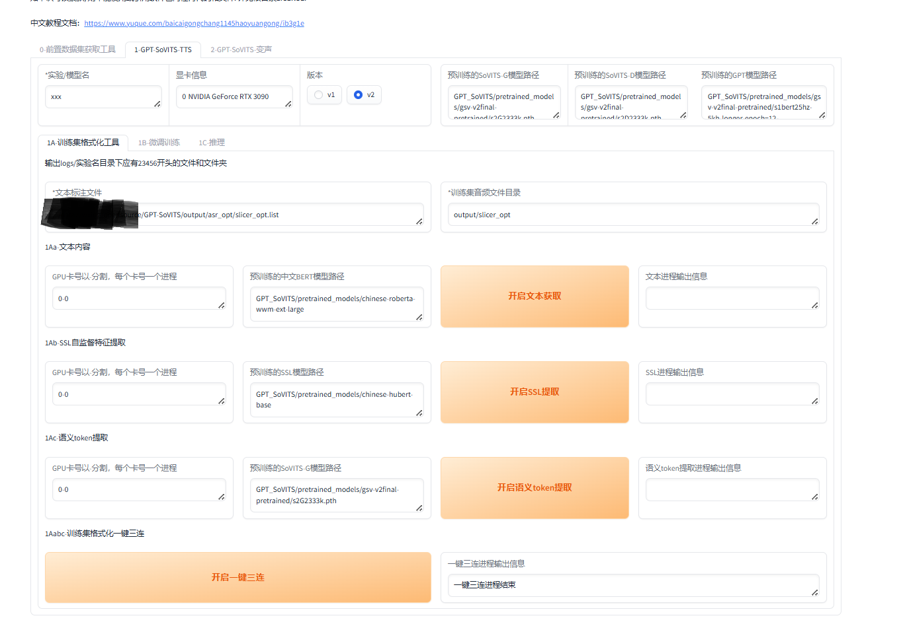
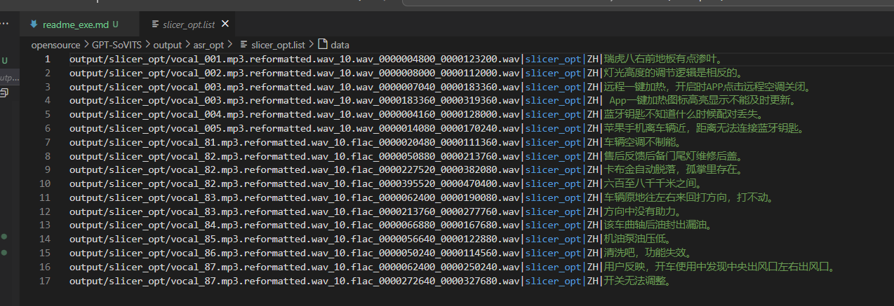
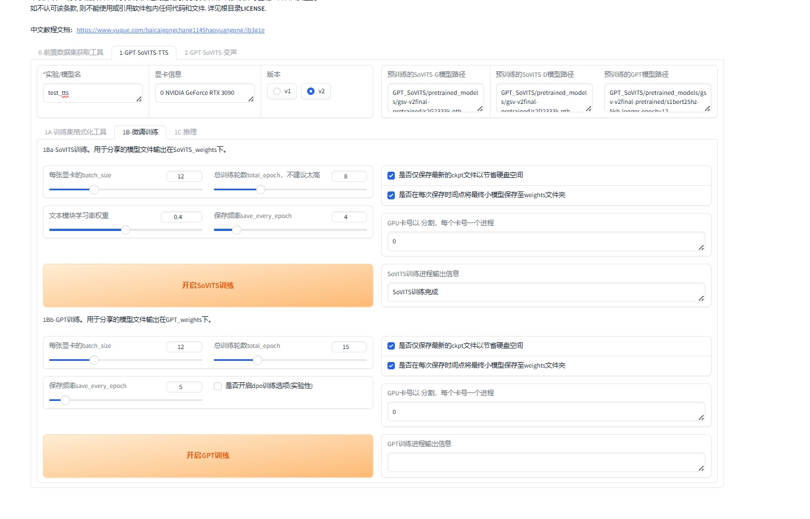

## GPT-SoVIT仓库介绍


| git仓库 | 地址 | 主要功能 | star/fork数
|:-|:-|:-|:-
| GPT-SoVITS |  [RVC-Boss/GPT-SoVITS](https://github.com/RVC-Boss/GPT-SoVITS.git) | 语音克隆 | 43k/4k


### 功能说明

- 项目是干啥的
  - **GPT-Sovits是一个强大的少样本语音转换和文本转语音（TTS）工具** 。它可以在仅有一分钟的语音数据的情况下，训练出高质量的TTS模型，实现语音克隆。
  - TTS（Text-To-Speech）是一种文字转语音的语音合成。类似的还有SVC（歌声转换）、SVS（歌声合成）等。
  - 详细可查看 [GPT-SoVITS指南](https://www.yuque.com/baicaigongchang1145haoyuangong/ib3g1e)


- 功能
  1. **零样本文本到语音（TTS）：** 输入 5 秒的声音样本，即刻体验文本到语音转换。
  2. **少样本 TTS：** 仅需 1 分钟的训练数据即可微调模型，提升声音相似度和真实感。
  3. **跨语言支持：** 支持与训练数据集不同语言的推理，目前支持英语、日语、韩语、粤语和中文。
  4. **WebUI 工具：** 集成工具包括声音伴奏分离、自动训练集分割、中文自动语音识别(ASR)和文本标注，协助初学者创建训练数据集和 GPT/SoVITS 模型。


- 各版本之间的功能

|  模型版本 | 语种主持（可跨语种合成） | GPT训练集时长 | SoVITS训练集时长                     | 推理速度     | 参数量     | 文本前端               | 功能                                                                                     |
|--------------------------|--------------------------|--------------|-------------------------------------|--------------|------------|------------------------|------------------------------------------------------------------------------------------|
| V1 202401| 中日英                   | 2k小时       | 2k小时                              | baseline     | 90M+77M    | baseline               | baseline                                                                                 |
| V2 202408 | 中日英韩粤               | 2.5k小时     | vq encoder2k小时，剩余5k小时         | 翻倍         | 90M+77M    | 中日英逻辑均有增强     | 新增语速调节，无参考文本模式，更好的混合语种切分，音色混合                               |
| V3 202502 | 中日英韩粤               | 7k小时       | vq encoder2k小时，剩余7k小时         | 约等于v2     | 330M+77M   | 不变                   | 大幅增加zero shot相似度；情绪表达、微调性能提升        


### demo说明


1. 启用demo如下
  - 服务启用就1行命令的事儿啦，不过前提是你要把模型准备好都


```sh
python webui.py
```




2. 具体安装步骤，详见git仓库的 [readme](./README.md) 部分


### 功能拆解


#### 准备工作

1. 准备好模型
  - huggingface上不去的话，去modelscope找吧
  - 版本信息，可参考下文的附录部分


| [模型名称](下载地址)                                                                                     | 功能                                      | 本地路径                     | 是否必须 |
|--------------------------------------------------------------------------------------------------------|-----------------------------------------|----------------------------|----------|
| [GPT-SoVITS Models](https://huggingface.co/lj1995/GPT-SoVITS)                                         | 预训练模型                               | GPT_SoVITS/pretrained_models | 是       |
| [G2PWModel](https://paddlespeech.bj.bcebos.com/Parakeet/released_models/g2p/G2PWModel_1.1.zip)        | 中文TTS文本处理（仅限中文TTS）            | GPT_SoVITS/text             | 是       |
| [UVR5 Weights](https://huggingface.co/lj1995/VoiceConversionWebUI/tree/main/uvr5_weights)             | 人声/伴奏分离与混响移除（额外功能）        | tools/uvr5/uvr5_weights     | 否       |
| [Damo ASR Model](https://modelscope.cn/models/damo/speech_paraformer-large_asr_nat-zh-cn-16k-common-vocab8404-pytorch/files)<br>[Damo VAD Model](https://modelscope.cn/models/damo/speech_fsmn_vad_zh-cn-16k-common-pytorch/files)<br>[Damo Punc Model](https://modelscope.cn/models/damo/punc_ct-transformer_zh-cn-common-vocab272727-pytorch/files) | 中文ASR（语音识别/端点检测/标点恢复，额外功能） | tools/asr/models            |  否      |
| [Faster Whisper Large V3](https://huggingface.co/Systran/faster-whisper-large-v3)<br>[其他模型](https://huggingface.co/Systran) | 英语/日语ASR（额外功能）                  | tools/asr/models            | 否       |


#### 模型推理

1. 推理实现


```bash
python GPT_SoVITS/inference_webui.py <language(optional)>
or
python webui.py # 然后在 `1-GPT-SoVITS-TTS/1C-推理` 中打开推理webUI
```


#### 模型训练


1. 前置数据集预处理
  - 如果音频足够干净，下面的步骤 1、3、5 是可以跳过的哦

| 步骤名称         | 方法简介                                                                 | 输入文件                                                                 | 输出文件                                                                 | 功能介绍       |
|------------------|--------------------------------------------------------------------------|--------------------------------------------------------------------------|--------------------------------------------------------------------------|----------------------------------------------------------------------------------------------------------------------------------------------------------------------------------------------------------|
| 使用UVR5处理原音频 | 通过特定模型处理音频以提取人声并进行去混响等操作    | 原音频文件   | 处理后的音频文件，包括人声(vocal)、伴奏(instrument)、 **无混响人声(vocal_main_vocal)** , 有混响(others)等，只保留无混响人声级即可。输出文件夹为output/uvr5_opt    | 先用model_bs_roformer_ep_317_sdr_12.9755模型处理原音频提取人声，再用onnx_dereverb和DeEcho-Aggressive去混响，输出格式为wav。  |
| 切割音频         | 将音频按照一定参数进行切割      | 原音频文件夹路径（如uvr5_opt文件夹）  | 切割后的音频文件夹，默认路径为output/slicer_opt    | 调整min_length、min_interval和max_sil_kept等参数，点击开启语音切割。切割后需手动将过长音频切分至显存数秒以下, **24g显存音频就切到24S以下** ，以防爆显存。若切割后仍是一个文件，可调低min_interval或用au手动切分。                     |
| 音频降噪         | 对切割后的音频进行降噪处理                                               | 切割完音频的文件夹（默认output/slicer_opt）                              | 降噪后的音频文件夹，默认路径为output/denoise_opt                         | 若原音频足够干净可跳过此步，降噪对音质破坏较大，需谨慎使用。点击开启语音降噪即可。                                                                                                                          |
| 打标             | 给每个音频配上文字标注                                                   | 切分或降噪后的音频文件夹路径                                            | 标注后的文件，默认路径为output/asr_opt                                   | 选择达摩ASR或fast whisper进行标注， **达摩ASR适合汉语和粤语，效果最好**  ；fast whisper可标注多种语言，模型尺寸选large V3，语种选auto自动，精度建议选float16。点击开启离线批量ASR，需关注控制台报错情况。           |
| 校对标注         | 对打标后的音频进行校对                                                   | 打标后的list路径                                                         | 校对后的标注文件                                                         | 点击开启打标webui进入SubFix界面，标注界面包括跳转页码、保存修改、合并音频、删除音频、上一页、下一页、分割音频、保存文件、反向选择等操作。每页修改后需保存修改，退出前需保存文件，删除音频需先点击yes。 **合并和分割音频精度差，不建议使用** ，操作前多保存以防出错。       |






2. 训练数据集格式
  - 文本到语音（TTS）注释 .list 文件格式：


```
vocal_path|speaker_name|language|text
eg. 
D:\GPT-SoVITS\xxx\xxx.wav|xxx|zh|我爱玩原神。
```






4. 开始训练了
  - 首先设置batch_size，sovits训练建议 **batch_size设置为显存的一半以下** ，高了会爆显存。
  - 接着设置轮数，相比V1，V2对训练集的还原更好，但也更容易学习到训练集中的负面内容。所以如果你的素材中有底噪、混响、喷麦、响度不统一、电流声、口水音、口齿不清、音质差等情况那么请不要调高SoVITS模型轮数，否则会有负面效果。GPT模型轮数一般情况下不高于20， **建议设置10** 。
  - 然后先点开启SoVITS训练，训练完后再点开启GPT训练，不可以一起训练（除非你有两张卡）！如果中途中断了，直接再点开始训练就好了，会从最近的保存点开始训练。





## 环境说明 

1. 资源说明
    - 其中版本号，为各个模型权重文件在 [modelscope](https://www.modelscope.cn/models/) 上的commitID
    - 内存和GPU使用，均为推理demo执行时的资源占用大小，batch size为8


| 是否可用 | 模型名称 | 功能简介 | 磁盘大小 | 内存消耗 | GPU | 版本号
| :-| :-| :-| :-| :-| :-| :-
| 是 | [GPT-SoVITS Models](https://www.modelscope.cn/models/AI-ModelScope/GPT-SoVITS)   | 预训练模型  | 1G |  |  | cf147
| 是 | [G2PWModel](https://paddlespeech.bj.bcebos.com/Parakeet/released_models/g2p/G2PWModel_1.1.zip)        | 中文TTS文本处理（仅限中文TTS）  | 1.5G |  |  | 
| 是 | [UVR5 Weights](https://www.modelscope.cn/models/AI-ModelScope/uvr5_weights)             | 人声/伴奏分离与混响移除（额外功能）  | 1G |  |  | e831e
| 是 | [Damo ASR Model](https://modelscope.cn/models/damo/speech_paraformer-large_asr_nat-zh-cn-16k-common-vocab8404-pytorch/files)<br>[Damo VAD Model](https://modelscope.cn/models/damo/speech_fsmn_vad_zh-cn-16k-common-pytorch/files)<br>[Damo Punc Model](https://modelscope.cn/models/damo/punc_ct-transformer_zh-cn-common-vocab272727-pytorch/files) | 中文ASR（语音识别/端点检测/标点恢复，额外功能）  | 1G/1M/0.3G | |  | 0dc8a/a99a3/1ac4a
| 是 | [Faster Whisper Large V3](https://www.modelscope.cn/models/gpustack/faster-whisper-large-v3/files)<br>[其他模型](https://huggingface.co/Systran) | 英语/日语ASR（额外功能）  | 4G  |  |  | 0181a


2. 环境说明
    - python库版本，请看requirements_env.txt

```sh
ubuntu1~20.04.1
NVIDIA GeForce RTX 3090 
Docker version 20.10.17
Python 3.9.21
CUDA Version: 12.2
nvcc: 12.6
```


3. 目录树
    - 分别包括简单版本和明细版本

```sh
.
├── api.py
├── api_v2.py
├── colab_webui.ipynb
├── config.py
├── Docker
├── dockerbuild.sh
├── docker-compose.yaml
├── Dockerfile
├── docs
├── go-webui.bat
├── go-webui.ps1
├── GPT_SoVITS
├── GPT_SoVITS_Inference.ipynb
├── gpt-sovits_kaggle.ipynb
├── install.sh
├── LICENSE
├── __pycache__
├── readme_exe.md
├── README.md
├── requirements_env.txt
├── requirements.txt
├── tools
└── webui.py
```


<details>
  <summary>详细目录树</summary>
  <pre><code> 
.
├── api.py
├── api_v2.py
├── colab_webui.ipynb
├── config.py
├── Docker
│   ├── damo.sha256
│   ├── download.py
│   ├── download.sh
│   ├── links.sha256
│   └── links.txt
├── dockerbuild.sh
├── docker-compose.yaml
├── Dockerfile
├── docs
│   ├── cn
│   │   ├── Changelog_CN.md
│   │   └── README.md
│   ├── en
│   │   └── Changelog_EN.md
│   ├── ja
│   │   ├── Changelog_JA.md
│   │   └── README.md
│   ├── ko
│   │   ├── Changelog_KO.md
│   │   └── README.md
│   └── tr
│       ├── Changelog_TR.md
│       └── README.md
├── go-webui.bat
├── go-webui.ps1
├── GPT_SoVITS
│   ├── AR
│   │   ├── data
│   │   ├── __init__.py
│   │   ├── models
│   │   ├── modules
│   │   ├── text_processing
│   │   └── utils
│   ├── configs
│   │   ├── s1big2.yaml
│   │   ├── s1big.yaml
│   │   ├── s1longer-v2.yaml
│   │   ├── s1longer.yaml
│   │   ├── s1mq.yaml
│   │   ├── s1.yaml
│   │   ├── s2.json
│   │   ├── train.yaml
│   │   └── tts_infer.yaml
│   ├── download.py
│   ├── export_torch_script.py
│   ├── feature_extractor
│   │   ├── cnhubert.py
│   │   ├── __init__.py
│   │   └── whisper_enc.py
│   ├── inference_cli.py
│   ├── inference_gui.py
│   ├── inference_webui_fast.py
│   ├── inference_webui.py
│   ├── module
│   │   ├── attentions_onnx.py
│   │   ├── attentions.py
│   │   ├── commons.py
│   │   ├── core_vq.py
│   │   ├── data_utils.py
│   │   ├── __init__.py
│   │   ├── losses.py
│   │   ├── mel_processing.py
│   │   ├── models_onnx.py
│   │   ├── models.py
│   │   ├── modules.py
│   │   ├── mrte_model.py
│   │   ├── quantize.py
│   │   └── transforms.py
│   ├── onnx_export.py
│   ├── prepare_datasets
│   │   ├── 1-get-text.py
│   │   ├── 2-get-hubert-wav32k.py
│   │   └── 3-get-semantic.py
│   ├── pretrained_models
│   ├── process_ckpt.py
│   ├── s1_train.py
│   ├── s2_train.py
│   ├── text
│   │   ├── cantonese.py
│   │   ├── chinese2.py
│   │   ├── chinese.py
│   │   ├── cleaner.py
│   │   ├── cmudict-fast.rep
│   │   ├── cmudict.rep
│   │   ├── engdict_cache.pickle
│   │   ├── engdict-hot.rep
│   │   ├── english.py
│   │   ├── g2pw
│   │   ├── __init__.py
│   │   ├── japanese.py
│   │   ├── ja_userdic
│   │   ├── korean.py
│   │   ├── namedict_cache.pickle
│   │   ├── opencpop-strict.txt
│   │   ├── symbols2.py
│   │   ├── symbols.py
│   │   ├── tone_sandhi.py
│   │   └── zh_normalization
│   ├── TTS_infer_pack
│   │   ├── __init__.py
│   │   ├── TextPreprocessor.py
│   │   ├── text_segmentation_method.py
│   │   └── TTS.py
│   └── utils.py
├── GPT_SoVITS_Inference.ipynb
├── gpt-sovits_kaggle.ipynb
├── install.sh
├── LICENSE
├── readme_exe.md
├── README.md
├── requirements_env.txt
├── requirements.txt
├── tools
│   ├── asr
│   │   ├── config.py
│   │   ├── fasterwhisper_asr.py
│   │   ├── funasr_asr.py
│   │   └── models
│   ├── cmd-denoise.py
│   ├── denoise-model
│   ├── i18n
│   │   ├── i18n.py
│   │   ├── locale
│   │   └── scan_i18n.py
│   ├── __init__.py
│   ├── my_utils.py
│   ├── slice_audio.py
│   ├── slicer2.py
│   ├── subfix_webui.py
│   └── uvr5
│       ├── bs_roformer
│       ├── bsroformer.py
│       ├── lib
│       ├── mdxnet.py
│       ├── uvr5_weights
│       ├── vr.py
│       └── webui.py
└── webui.py
  </code></pre>
</details>